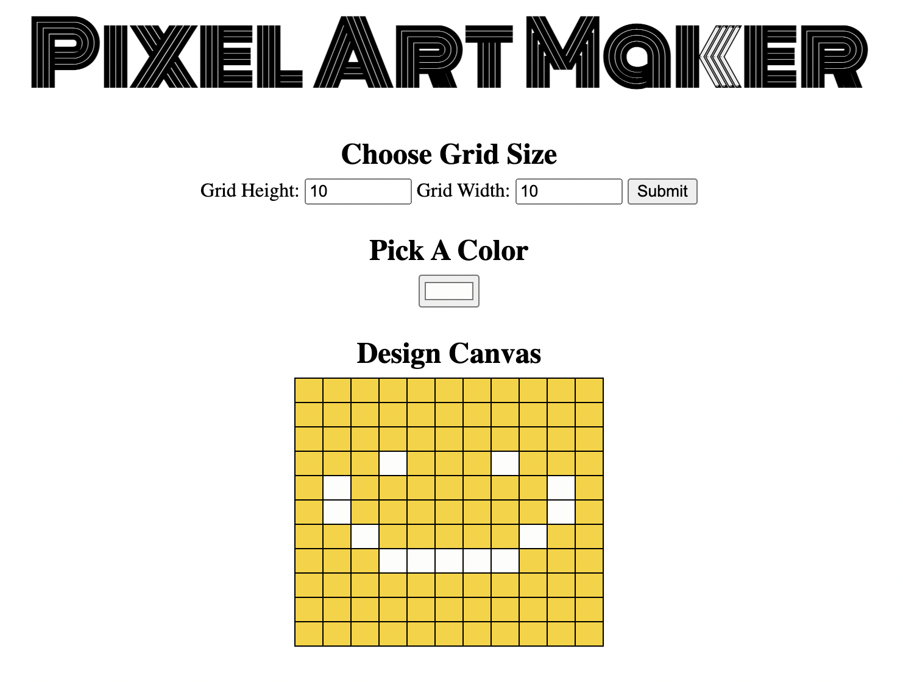

# pixel_art

Pixel Art Project - Udacity - Full Stack Developer Program

# Instructions

- Select your grid size
- Select your color
- Click submit in order to create your grid
- Single click to color
- Double click to remove color

> Have fun!

